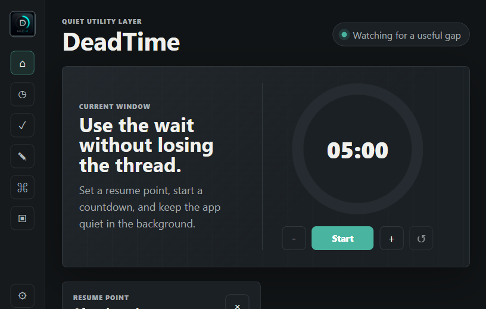

# DeadTime

DeadTime is a lightweight desktop productivity companion for the small waiting windows between tasks, renders, downloads, diagnostics, scans, installs, and workflows.

**Status:** public beta / experimental utility.

It is intentionally not a full productivity suite. The beta goal is simple: keep momentum during waiting periods without inviting distraction.

## Current Status

DeadTime `v0.1.0-beta` is a source beta/local preview.

This release is **not an installer yet**. If you download it from GitHub, you are downloading the project source files. Desktop packaging for Windows is planned next.

## Beta Features

- Countdown timer with restart, reset, and persisted state
- Resume point field for the next action after the wait
- Background wait tracking for renders, installs, scans, uploads, and similar work
- Mini task checklist for tiny actions
- Scratchpad for quick notes
- Fast launch shortcuts for notes, tasks, resume point, and cleanup
- Local-first storage through `localStorage`
- Dark/light theme
- Optional compact mode for small windows
- Lightweight settings panel
- Optional quiet feedback sounds
- Onboarding hint that can be dismissed
- Responsive layout for narrow utility windows

## Download And Run

### Requirements

- Windows, macOS, or Linux
- Node.js 18 or newer
- A modern browser

### Option 1: Download ZIP

1. Open the GitHub repository.
2. Click **Code**.
3. Click **Download ZIP**.
4. Unzip the folder.
5. Open a terminal in the unzipped `DeadTime` folder.
6. Run:

```powershell
node .\serve.mjs
```

7. Open:

```text
http://127.0.0.1:4173/
```

### Option 2: Clone With Git

```powershell
git clone https://github.com/selmir100/DeadTime.git
cd DeadTime
node .\serve.mjs
```

Then open:

```text
http://127.0.0.1:4173/
```

## Development Preview

Run the local preview server:

```powershell
node .\serve.mjs
```

Then open:

```text
http://127.0.0.1:4173/
```

The app can also be opened directly from `index.html`, but the local server is closer to how it would run inside a desktop shell.

## Screenshots



## What You Are Downloading

You are downloading a local-first web preview of DeadTime. It runs on your machine and stores state in your browser's local storage.

Included files:

- `index.html` - app structure
- `styles.css` - app styling
- `app.js` - app behavior and local persistence
- `serve.mjs` - tiny local preview server
- `DeadTime Logo.png` - logo asset
- `PRIVACY.md` - data and metadata notes
- `LICENSE.md` - MIT license

There is no account system, cloud sync, telemetry, or bundled executable in this beta.

## Privacy And Metadata

- DeadTime does not send your notes, tasks, timers, or wait labels anywhere.
- App data stays in browser `localStorage`.
- The logo PNG was stripped of nonessential PNG metadata before release.
- Git commit metadata uses the GitHub noreply email for the publishing account.

## Desktop Packaging Direction

The recommended desktop shell is Tauri because it keeps RAM and disk usage low by using the system WebView. The current frontend is plain HTML, CSS, and JavaScript so it can be moved into a Tauri app with minimal churn.

Near-term native additions:

- tray icon
- minimize to tray
- native notifications
- app data storage
- launch selected local tools
- optional start on login

## Design Principles

- Small time windows still matter.
- Productivity should stay calm.
- The app should save momentum, not create another place to manage work.
- Defaults should be quiet and recoverable after restart.
